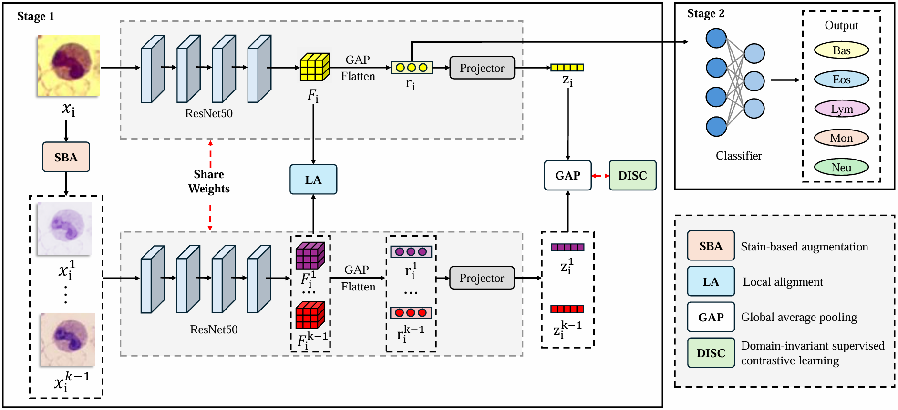
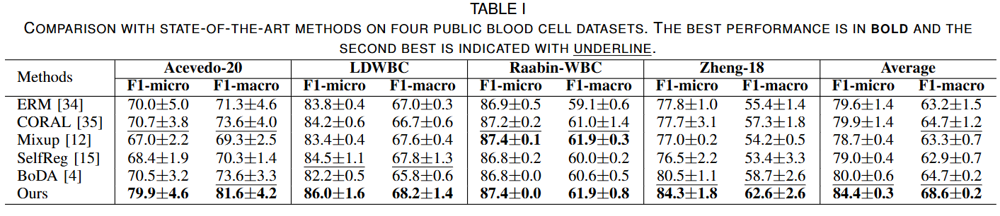

# SADA
Official PyTorch implementation of Stain-aware Domain Alignment for Imbalanced Blood Cell Classification

Yongcheng Li, Lingcong Cai, Ying Lu, Xianghua Fu, Xiao Han, Ma Li, Wenxing Lai, Xiangzhong Zhang, and Xiaomao Fan

Note that this project is built upon [SWAD](https://github.com/facebookresearch/DomainBed/tree/3fe9d7bb4bc14777a42b3a9be8dd887e709ec414) and [DomainBed@3fe9d7](https://github.com/facebookresearch/DomainBed/tree/3fe9d7bb4bc14777a42b3a9be8dd887e709ec414).

## Overview
<p align="center">
    
</p>

## Datasets
We use four different white blood cells datasets to evaluate our method:
<ul>
  <li> 
    The <strong>Acevedo-20</strong> dataset contains 17,092 blood cell images of
    normal individuals with 8 classes. The images with a resolu-
    tion of 360 × 363 pixels were generated by Sysmex SP1000i
    slide maker-stainer with May Gr ̈unwald-Giemsa staining. It is published by Acevedo et al. <a href="https://www.data-in-brief.com/article/S2352-3409(20)30368-1/fulltext">A dataset of microscopic peripheral blood cell images for the development of automatic recognition systems.</a>
  </li>
  <li>
    The <strong>Raabin-WBC</strong> donsists of 16,633 white blood cell images in 5 categories, captured with Olympus CX18 and Zeiss microscopes at 100x magnification. It contains images of varying dimensions in each category and all the samples are stained with Giemsa. It is published by Z. M. Kouzehkanan et al. <a href="https://www.nature.com/articles/s41598-021-04426-x">A large dataset of white blood cells containing cell locations and types, along with segmented nuclei and cytoplasm.</a>
  </li>
  <li>
    The <strong>LDWBC</strong> onsists of 150 blood cell images from healthy individuals with 5 different categories, which were stained with the Wright&Gimsa solution with the resolution of 1280 × 1280. <a href="https://ieeexplore.ieee.org/abstract/document/9669587">Transmixnet: an attention based double-branch model for white blood cell classification and its training with the fuzzified training data</a>
  </li>
  <li>
    The <strong>Zheng-18</strong> ncludes 300 images of individual blood cells cropped from 80 source images captured by a Motic Moticam Pro 252A optical microscope camera with a size of 120 × 120 pixels. <a href="https://www.sciencedirect.com/science/article/abs/pii/S0968432817303037">Fast and robust segmentation of white blood cell images by self-supervised learning</a>
  </li>
</ul>

## Results
<p align="center">
    
</p>

## Usage
### Installation
```sh
cd SADA
conda create -n SADA python=3.9
conda activate SADA
pip install torch==2.0.1+cu118 torchvision==0.15.2+cu118 --index-url https://download.pytorch.org/whl/cu118
pip install -r requirements.txt
```

### How to run
#### step 1 : download datasets
You can download the datasets through the links in [Datasets](#datasets). Here, for easy replication, we provide a package that integrates four datasets [WBC_DG.tar](https://drive.google.com/file/d/1I6fCSOh7tvWLOTCMLqDlMHYJms2HlW0c/view?usp=drive_link).
```sh
tar xf WBC_DG.tar -C ./domainbed/datasets/
```
```sh
├── ./domainbed
    ├── datasets
        __init__.py
        datasets.py
        transforms.py
        WBC_DG
        ├── dataset1
            ├── class1
                ├── img1
                ├── img2
                ├── img3
                ...
            ├── class2
            ├── class3
            ...
        ├── dataset2
        ├── dataset3
          ...
```
#### step 2 : start training
```sh
python train_all.py --data_dir domainbed/datasets
```
